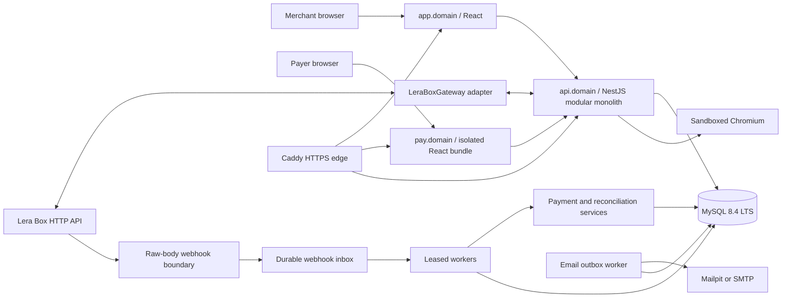
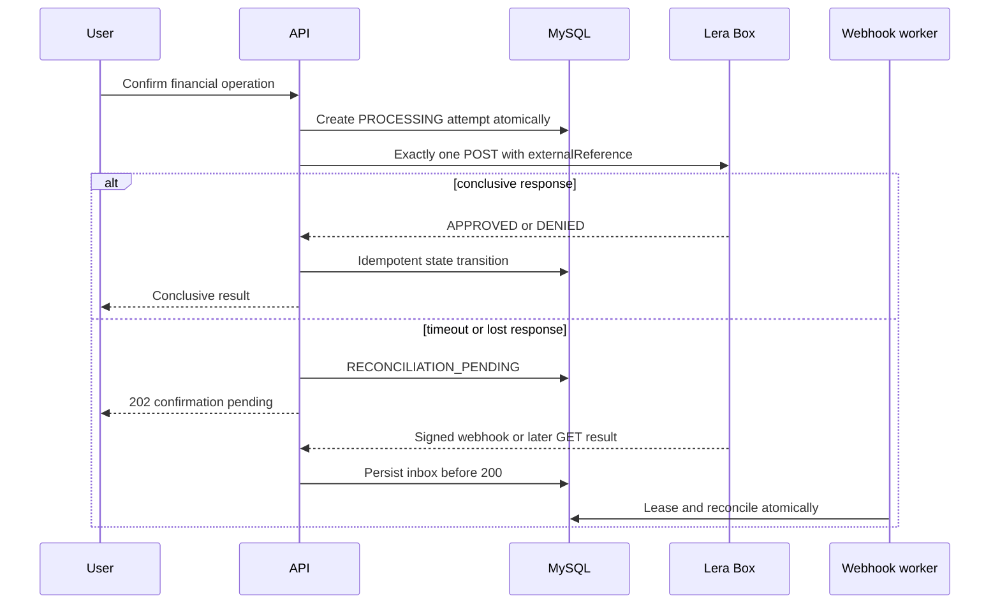

# BaaS Console Design

**Spec**: `.specs/features/baas-console/spec.md`

**Context**: `.specs/features/baas-console/context.md`

**Project decisions**: `.specs/STATE.md`

**Status**: Draft for user approval

## Recommended Architecture

Um monorepo npm contem um monolito modular NestJS, uma aplicacao React/Vite, um cliente TypeScript gerado do OpenAPI interno, um pacote de suporte a testes e um pequeno pacote de template de comprovante compartilhado. MySQL e a verdade duravel local; a Lera Box permanece uma dependencia HTTP e a autoridade para saldo e resultados remotos.

### Complexity Gate

| Approach | Cost | Benefit | Verdict |
| --- | --- | --- | --- |
| Modular monolith with selective ports | Um processo backend e cerca de 10 modulos de negocio; interfaces apenas em limites externos | Isolamento suficiente, testes simples, deploy unico e baixo Navigation Paradox | **Recommended** |
| Full hexagonal/clean architecture | Multiplica DTOs, mappers, repositories, use cases e arquivos em praticamente cada modulo | Facilitaria trocar banco/framework, uma necessidade nao demonstrada | Rejected as ceremony |
| Microservices and broker | Multiplos deploys, contratos remotos, tracing distribuido, operacao e consistencia eventual adicional | Escala e ownership independentes inexistentes neste teste | Rejected as disproportionate |

O pacote adicional `receipt-template` custa um boundary e poucos arquivos, mas evita divergencia entre HTML e PDF e permite renderizacao estatica segura. Essa complexidade e localizada e se paga pelo requisito explicito de PDF via Playwright.

## Architecture Overview



### Request and effect boundaries



## Repository Shape

```text
.
|-- apps/
|   |-- api/
|   `-- web/
|-- packages/
|   |-- api-client/
|   |-- receipt-template/
|   `-- test-support/
|-- scripts/
|-- docs/
|-- .specs/
|-- docker-compose.yml
|-- docker-compose.prod.yml
`-- package.json
```

`receipt-template` e a unica adicao ao esqueleto conversado. Ele exporta um view model estrito, componente estatico e CSS de tela/impressao; nao contem consulta, segredo, sessao ou chamada HTTP.

## Code Reuse Analysis

O workspace estava vazio no inicio desta fase, portanto nao existem componentes internos para reutilizar. O design evita criar wrappers para capacidades ja oferecidas por NestJS, TypeORM, React Query, React Hook Form, Zod, Pino, `prom-client` e Playwright.

| Capability | Reuse strategy |
| --- | --- |
| Validation | `class-validator`/`class-transformer` no backend; Zod somente para UX no frontend |
| OpenAPI client | Gerar de Swagger interno; nao duplicar DTO manualmente no web |
| Async server state | TanStack Query; nao introduzir Redux/XState |
| Forms | React Hook Form com schemas de UX |
| Database | TypeORM repositories/data source diretamente nos modulos simples |
| Logging | Pino serializers allowlisted, sem logger proprietario generico |
| Metrics | `prom-client` com nomes e labels controlados |
| Browser/PDF | Playwright Chromium compartilhando template de recibo |

## Runtime and Packages

| Layer | Choice | Notes |
| --- | --- | --- |
| Runtime | Node.js 24 LTS | ESM onde suportado; versao patch fixada |
| API | NestJS 11 + Express | Default mais simples para middleware, Supertest e raw body |
| Persistence | TypeORM + `mysql2` + MySQL 8.4 LTS | `synchronize=false`; migrations only |
| Web | React 19 + Vite + React Router | Dashboard e checkout em chunks/superficies separados |
| Data fetching | TanStack Query | Invalidacao explicita depois de confirmacao financeira |
| Forms | React Hook Form + Zod | Backend continua autoridade de validacao |
| Logs | `nestjs-pino`/Pino | JSON stdout |
| Tests | Jest, Supertest, Vitest, Testing Library, Cucumber.js, Playwright, StrykerJS | Suites por nivel |
| Containers | Docker Compose, Nginx, Caddy | GHCR em producao |

## Backend Modules

### `AuthModule`

- **Purpose**: Cadastro local, login, refresh rotation, logout, convites e sessao demo.
- **Interfaces**: `registerOwner`, `login`, `rotateRefreshToken`, `revokeSession`, `issueDemoSession`.
- **Dependencies**: `MerchantsModule`, `GatewayAccountsModule`, `EncryptionService`, `Clock`, `IdGenerator`.
- **Security**: Argon2id, refresh token hash, family reuse detection, rate limits e CSRF nos endpoints cookie-authenticated.

### `MerchantsModule`

- **Purpose**: Tenant raiz, perfil do lojista e aplicacao das regras `demoMode`.
- **Interfaces**: `getCurrentMerchant`, `updatePermittedProfileFields`, `assertMutableSession`.
- **Dependencies**: MySQL e audit events.
- **Invariant**: Nenhum request autenticado aceita tenant selecionado pelo cliente.

### `GatewayAccountsModule`

- **Purpose**: Cadastro/conexao Lera Box, armazenamento criptografado e estado da dependencia.
- **Interfaces**: `registerAtGateway`, `connectGateway`, `getDecryptedAccess`, `markReconnectRequired`.
- **Dependencies**: `LeraBoxGateway`, `EncryptionService`.
- **Invariant**: Senha do gateway nunca cruza o caso de uso de conexao nem aparece no frontend/log.
- **Partial failure**: Cadastro remoto grava tentativa antes do POST; falha conclusiva e `GATEWAY_REGISTRATION_UNKNOWN` sao distintos e nenhum timeout e repetido automaticamente.

### `CheckoutLinksModule`

- **Purpose**: Criacao imutavel, token publico, expiracao, cancelamento e listagem.
- **Interfaces**: `createLink`, `cancelLink`, `exchangePublicToken`, `getCheckoutView`, `listLinks`.
- **Dependencies**: Fees via gateway, `EncryptionService`, `Clock`, `IdGenerator`.
- **Invariant**: Uma constraint impede mais de uma tentativa nao resolvida por link.

### `PaymentsModule`

- **Purpose**: Tentativas Pix/cartao, taxa, chamada unica, transicoes e projecao financeira.
- **Interfaces**: `createPixAttempt`, `quoteCardAttempt`, `confirmCardAttempt`, `applyPaymentOutcome`.
- **Dependencies**: `LeraBoxGateway`, checkout links, transactions, financial events, audit.
- **Invariant**: Timeout nao repete POST e bloqueia nova tentativa ate conciliacao.

### `WebhooksModule`

- **Purpose**: Configuracao de endpoints/secrets, raw-body HMAC, inbox, dedupe, leases e dead letter.
- **Interfaces**: `configureEndpoints`, `acceptRawEvent`, `leaseNextEvent`, `processEvent`.
- **Dependencies**: Payments, withdrawals, reconciliation, encryption.
- **Boundary**: Express inicia com `rawBody: true`; o body parseado nunca substitui bytes usados na assinatura.

### `ReconciliationModule`

- **Purpose**: Resolver resultados desconhecidos, comparar projecao/gateway e classificar divergencias.
- **Interfaces**: `schedule`, `reconcilePayment`, `reconcileWithdrawal`, `reconcileMerchantStatement`.
- **Dependencies**: Gateway, transactions, webhook events, clock.
- **Concurrency**: `nextReconciliationAt`, `leaseUntil`, attempts e ultimo erro sanitizado.

### `WalletModule`

- **Purpose**: Snapshot autoritativo remoto, staleness e consultas do extrato/projecao.
- **Interfaces**: `refreshWallet`, `getWalletView`, `listTransactions`.
- **Dependencies**: Gateway e transaction projection.
- **Invariant**: Erro remoto nao grava zero.

### `WithdrawalsModule`

- **Purpose**: Confirmacao e envio unico de saque, mascaramento e conciliacao.
- **Interfaces**: `previewWithdrawal`, `submitWithdrawal`, `applyWithdrawalOutcome`.
- **Dependencies**: Gateway, transactions, financial events, encryption.
- **Invariant**: Destino integral nao persiste depois do envio.

### `NotificationsModule`

- **Purpose**: Outbox, templates de e-mail, idempotencia, retries e dead letter.
- **Interfaces**: `queueCheckoutLink`, `queueApprovedReceipt`, `leaseDelivery`, `deliver`.
- **Dependencies**: `EmailSender`, clock, checkout/receipt tokens.
- **Concurrency**: Lease atomico e chave de idempotencia unica.

### `ReceiptsModule`

- **Purpose**: Token read-only, view model allowlisted, HTML e PDF.
- **Interfaces**: `issueReceiptToken`, `getReceipt`, `renderPdf`, `revokeReceiptToken`.
- **Dependencies**: `ReceiptPdfRenderer`, shared receipt template, transactions.
- **Invariant**: Somente `APPROVED`; sem taxa do lojista, PAN, CVV, payload ou IDs internos.

### `ObservabilityModule`

- **Purpose**: Request context, Pino, RFC 9457, metricas e health endpoints.
- **Interfaces**: middleware/interceptors/filters e registries internos.
- **Dependencies**: Database health; gateway aparece em dependencies, nao em readiness basica.

### `AuditModule`

- **Purpose**: Registrar acoes sensiveis e mudancas de configuracao sem armazenar segredos.
- **Interfaces**: `recordAuditEvent` com tipo, ator, tenant, alvo opaco e metadados allowlisted.

## External and Testable Interfaces

```typescript
interface LeraBoxGateway {
  registerUser(input: GatewayRegistration): Promise<void>;
  login(input: GatewayLogin): Promise<GatewaySession>;
  getFees(filter?: FeeFilter): Promise<GatewayFee[]>;
  createPix(input: GatewayPixRequest): Promise<GatewayPixResponse>;
  createCard(input: GatewayCardRequest): Promise<GatewayPaymentResponse>;
  getPayment(id: string): Promise<GatewayPayment>;
  getWallet(): Promise<GatewayWallet>;
  listWalletTransactions(filter: GatewayStatementFilter): Promise<GatewayStatement>;
  createWithdrawal(input: GatewayWithdrawalRequest): Promise<GatewayWithdrawal>;
  getWithdrawal(id: string): Promise<GatewayWithdrawal>;
  listWebhooks(): Promise<GatewayWebhook[]>;
  createWebhook(input: GatewayWebhookRegistration): Promise<GatewayWebhook>;
  deleteWebhook(id: string): Promise<void>;
}

interface EmailSender {
  send(message: SanitizedEmailMessage): Promise<EmailSendReceipt>;
}

interface EncryptionService {
  encrypt(plaintext: Uint8Array, context: string): EncryptedEnvelope;
  decrypt(envelope: EncryptedEnvelope, context: string): Uint8Array;
  blindIndex(value: string, context: string): string;
}

interface ReceiptPdfRenderer {
  render(view: ReceiptViewModel): Promise<Uint8Array>;
}

interface Clock {
  now(): Date;
}

interface IdGenerator {
  uuid(): string;
  randomToken(bytes: number): Uint8Array;
}
```

Nao sera criada interface para repository TypeORM por padrao. Um repository especifico so existe quando encapsula query/lock complexo e comprovadamente reutilizado.

## Frontend Architecture

### Applications and routing

- `app` host: login, onboarding, dashboard, links, transacoes, carteira, saques, webhooks e configuracoes.
- `pay` host: troca de token, checkout, resultado e comprovante.
- `api` host: REST `/api/v1`, auth, webhooks, health, Swagger e PDF.
- React Router define rotas; TanStack Query mantem server state; formularios usam React Hook Form.
- O cliente OpenAPI gerado e a unica camada HTTP usada por features React.

### Design primitives

Limite inicial de 11 primitivas: `Button`, `IconButton`, `TextField`, `Select`, `Checkbox`, `Dialog`, `Toast`, `Badge`, `Card`, `Table` e `Skeleton`. Radix pode fornecer somente primitivas complexas de acessibilidade; nao sera copiado um kit visual inteiro.

### Financial interaction policy

- Mutacoes desabilitam a acao correspondente e mostram estado real.
- Resultado remoto desconhecido exibe conciliacao, nunca sucesso/erro inventado.
- Query invalidation ocorre apenas depois de resposta conclusiva ou webhook/reconciliacao observada.
- Timers possuem texto acessivel e nao dependem de animacao.
- QR sempre acompanha acao de copiar EMV.

## Data Model

Todos os IDs internos sao UUIDs. Timestamps usam UTC com precisao de microssegundos. Valores usam `BIGINT UNSIGNED`; taxas usam basis points inteiros. Tabelas tenant-scoped contem `merchantId` e relacionamentos compostos quando necessario para impedir referencias cruzadas.

### 1. `merchants`

- `id`, `legalName`, `displayName`, `status`, `demoMode`, `createdAt`, `updatedAt`.
- Raiz do tenant; `demoMode` imutavel pela propria sessao demo.

### 2. `users`

- `id`, `merchantId`, `email`, `passwordHash`, `status`, `lastLoginAt`, timestamps.
- Unique normalizado em e-mail; exatamente um owner ativo por merchant neste escopo.

### 3. `auth_sessions`

- `id`, `merchantId`, `userId`, `familyId`, `refreshTokenHash`, `expiresAt`, `rotatedAt`, `revokedAt`, `reuseDetectedAt`, metadados allowlisted.
- Indices por hash/family/expiry; nunca guarda refresh plaintext.

### 4. `gateway_accounts`

- `id`, `merchantId`, `status`, `gatewayUserId` se comprovado, `codigoClienteCiphertext`, `chaveLojaCiphertext`, `accessTokenCiphertext`, `tokenExpiresAt`, `lastConnectedAt`, `lastErrorCode`.
- Unique por merchant; senha do gateway ausente por design.

### 5. `checkout_links`

- `id`, `merchantId`, `publicReference`, `description`, `amountCents`, `allowedMethods`, `maxInstallments`, `feeSnapshotJson`, `status`, `expiresAt`.
- `publicTokenHash`, `publicTokenCiphertext`, `tokenClosedAt` permitem lookup seguro e reenvio controlado.
- Constraints de valor, expiracao, status e unique `(merchantId, publicReference)`.

### 6. `payment_attempts`

- `id`, `merchantId`, `checkoutLinkId`, `method`, `status`, `externalReference`, `gatewayPaymentId`, `gatewayTxId`, `installments`, `feeBps`, `cardBrand`, `cardLast4`, `failureCode`, `reconciliationAttempts`, `nextReconciliationAt`, `leaseUntil`, timestamps.
- Constraint/locking garante uma tentativa unresolved por link.
- PAN, CVV, nome completo do cartao e raw request nao existem no schema.

### 7. `withdrawals`

- `id`, `merchantId`, `externalReference`, `amountCents`, `status`, `gatewayWithdrawalId`, `destinationType`, `destinationMasked`, `destinationBlindIndex`, campos de conciliacao e timestamps.
- Destino integral nunca persiste.

### 8. `transactions`

- `id`, `merchantId`, `originType`, `originId`, `externalReference`, `gatewayTransactionId`, `type`, `status`, `grossAmountCents`, `feeAmountCents`, `netAmountCents`, `occurredAt`, `projectionVersion`.
- Campos de receipt token: `receiptTokenHash`, `receiptTokenCiphertext`, `receiptTokenExpiresAt`, `receiptTokenRevokedAt`, `receiptTokenVersion`.
- Unique por origem e identificadores remotos comprovados; projecao reconstruivel.

### 9. `financial_events`

- `id`, `merchantId`, `paymentAttemptId` nullable, `withdrawalId` nullable, `eventType`, `previousStatus`, `newStatus`, `source`, `occurredAt`, `metadataJson` allowlisted.
- Check constraint exige exatamente uma origem: pagamento XOR saque.
- Historico de transicoes, nao ledger contabil.

### 10. `wallet_snapshots`

- `id`, `merchantId`, `balanceCents`, `availableCents` se comprovado, `capturedAt`, `sourceRequestId` opaco.
- Indice `(merchantId, capturedAt DESC)`; view seleciona o ultimo e calcula staleness.

### 11. `webhook_endpoints`

- `id`, `merchantId`, `publicEndpointId`, `eventType`, `gatewayWebhookId`, `secretCiphertext`, `status`, `configuredAt`, `lastReceivedAt`.
- Unique por merchant/event e por endpoint opaco; URL nao revela tenant.

### 12. `webhook_events`

- `id`, `merchantId`, `webhookEndpointId`, `dedupeKey`, `rawBodyCiphertext`, `rawBodyHash`, `signatureMetadata`, `status`, `attempts`, `nextAttemptAt`, `leaseUntil`, `lastErrorCode`, `receivedAt`, `processedAt`, `purgeAfter`.
- Unique por endpoint/dedupe; raw payload criptografado por 90 dias.

### 13. `email_deliveries`

- `id`, `merchantId`, `kind`, `idempotencyKey`, `recipientCiphertext` quando necessario para retry, `recipientMasked`, `templateVersion`, `payloadCiphertext`, `status`, `attempts`, `nextAttemptAt`, `leaseUntil`, `providerMessageId`, `lastErrorCode`, timestamps, `purgeAfter`.
- Unique `(merchantId, idempotencyKey)`; conteudo/destinatario recuperavel purgado em 30 dias.

### 14. `audit_events`

- `id`, `merchantId`, `actorUserId` nullable, `actorType`, `action`, `targetType`, `targetPublicId`, `requestId`, `metadataJson` allowlisted, `createdAt`.
- Append-only pela aplicacao; sem payloads ou segredos.

## State Machines

### Checkout link

```text
ACTIVE -> PAID | EXPIRED | CANCELLED
EXPIRED/CANCELLED -> PAID only for authenticated late approval
PAID is terminal
```

### Payment attempt

```text
PROCESSING -> PENDING | APPROVED | DENIED | RECONCILIATION_PENDING
PENDING -> APPROVED | DENIED | EXPIRED | RECONCILIATION_PENDING
RECONCILIATION_PENDING -> APPROVED | DENIED | EXPIRED | MANUAL_REVIEW
DENIED/EXPIRED/APPROVED are terminal for the attempt
```

### Withdrawal

```text
PROCESSING -> PENDING | APPROVED | DENIED | RECONCILIATION_PENDING
PENDING/RECONCILIATION_PENDING -> APPROVED | DENIED | MANUAL_REVIEW
```

### Webhook event

```text
RECEIVED -> PROCESSING -> PROCESSED
RECEIVED/PROCESSING -> RETRY_SCHEDULED -> PROCESSING
RECEIVED/PROCESSING -> UNPROCESSABLE | DEAD_LETTER
```

### E-mail delivery

```text
QUEUED -> SENDING -> SENT
SENDING -> FAILED -> QUEUED
FAILED -> DEAD_LETTER after attempt limit
```

Todas as transicoes usam update condicional sobre o estado anterior esperado. Um update com zero linhas e tratado como concorrencia/idempotencia a investigar, nunca como sucesso presumido.

## Token and Session Design

### Local app session

- Access token curto devolvido ao cliente e mantido somente em memoria.
- Refresh token opaco em cookie da API; hash no banco; rotacao por familia.
- CORS permite apenas `app` aprovado; requests com cookie exigem header CSRF ligado a sessao.

### Checkout session

- Link usa fragmento para evitar token em proxy/referrer.
- `POST /api/v1/public/checkout-sessions` troca o token uma vez por cookie de sessao curta e token CSRF em memoria.
- Responses usam `Cache-Control: no-store` e `Referrer-Policy: no-referrer`.
- `pay` usa CSP sem terceiros e `frame-ancestors 'none'`.

### Receipt access

- Token independente e read-only; hash para lookup e ciphertext apenas para e-mail/reemissao controlada.
- Aprovacao fecha o checkout token.
- Revogacao/versionamento invalida links anteriores.

## Gateway Contract Strategy

1. Congelar o OpenAPI conhecido como evidencia de referencia, nao como verdade completa.
2. Criar conta sandbox com segredos apenas em env local ignorado.
3. Executar chamadas controladas para cadastro/login, taxas, Pix, cartao, consulta, carteira, saque e webhooks.
4. Capturar fixtures removendo e substituindo todos os identificadores, tokens, documentos, telefones e e-mails.
5. Determinar raw bytes, encoding e headers da assinatura HMAC.
6. Implementar stub HTTP deterministico a partir das fixtures.
7. Manter teste live manual separado por causa de resultados aleatorios.

Nenhum campo de response, regra de retry do gateway ou formato de webhook sera inventado antes desse spike.

## PDF Rendering Design

- O API cria `ReceiptViewModel` por allowlist e o renderiza estaticamente pelo pacote compartilhado.
- O contexto Chromium tem JavaScript desabilitado, todas as requisicoes de rede abortadas e fontes/CSS incorporados.
- Um browser persistente e reiniciado sob mutex apos `disconnected` ou falha de health interno.
- Cada chamada cria e fecha seu proprio context/page em `finally`.
- Semaphore inicia com capacidade 1 e fila bounded; excesso recebe `503` e `Retry-After`.
- Chromium executa non-root com sandbox explicitamente habilitado e seccomp apropriado; `--no-sandbox` e proibido.
- `page.pdf()` usa CSS print e devolve buffer; nenhum path de saida permanente e usado.
- O processo do browser recebe ambiente minimo sem chaves do gateway/criptografia.
- Se benchmark demonstrar impacto material na API, o mesmo renderer podera migrar para container interno isolado sem alterar `ReceiptPdfRenderer`.

## E-mail Outbox Design

- O caso de uso grava `email_deliveries` e a operacao de negocio relacionada na transacao apropriada.
- Um scheduler curto adquire lote por `leaseUntil`, marca `SENDING`, chama `EmailSender` e confirma `SENT`.
- Backoff aprovado: tentativa imediata e novas tentativas em 1, 5, 15 e 60 minutos.
- Crash depois do SMTP e antes do commit pode reenviar; provider message key/idempotency e chave local reduzem duplicidade, e o comportamento real sera documentado conforme provedor.
- Logs incluem somente deliveryId, kind, attempt, provider code seguro e recipient masked.

## Error Handling Strategy

Todas as respostas de erro usam `application/problem+json`, `type`, `title`, `status`, `code`, `detail` seguro, `instance` e `requestId` interno. Codigos sao estaveis em ingles; a UI traduz para portugues. Uma resposta `202` de resultado financeiro desconhecido nao e erro RFC 9457: ela devolve a representacao da operacao pendente com `code=RECONCILIATION_PENDING`.

| Scenario | HTTP | Code | User impact |
| --- | ---: | --- | --- |
| DTO/format invalid | 400 | `VALIDATION_FAILED` | Campos especificos corrigiveis |
| Missing/invalid local auth | 401 | `AUTH_REQUIRED` | Novo login |
| Invalid webhook signature | 401 | `WEBHOOK_SIGNATURE_INVALID` | Gateway pode diagnosticar sem detalhe criptografico |
| Same-tenant forbidden action | 403 | `ACTION_FORBIDDEN` | Acao indisponivel |
| Demo mutation | 403 | `DEMO_READ_ONLY` | Orienta usar conta do avaliador |
| Missing or cross-tenant resource | 404 | `RESOURCE_NOT_FOUND` | Nao revela outro tenant |
| Invalid state / duplicate unresolved attempt | 409 | `STATE_CONFLICT` | Interface recarrega estado real |
| Rate limit | 429 | `RATE_LIMITED` | Exibe `Retry-After` |
| Financial result unknown | 202 | `RECONCILIATION_PENDING` | Representacao pendente; acompanha sem retry |
| Gateway read unavailable | 503 | `GATEWAY_UNAVAILABLE` | Preserva snapshot e permite retry seguro |
| PDF saturated | 503 | `PDF_RENDERER_BUSY` | Download pode ser repetido |
| Unexpected internal error | 500 | `INTERNAL_ERROR` | RequestId para suporte, sem stack |

Erros Axios/HTTP brutos sao convertidos no adapter para `dependency`, `operation`, status remoto permitido, timeout, duracao e code seguro. Body, headers e config nunca seguem para logger/problem response.

## Logging, Metrics and Health

### Logging

- JSON stdout, UTC, nivel por ambiente.
- `requestId` sempre gerado internamente; correlation id valido do cliente e campo separado.
- Allowlist anterior a qualquer redaction; redaction continua como defesa adicional.
- Campos comuns: service, env, version, requestId, routeTemplate, method, status, durationMs, tenantHash opcional nao reversivel quando realmente necessario.

### Metrics

- HTTP por method/routeTemplate/status class.
- Gateway por operation/outcome/status class/timeout.
- Webhook por event/status, processing duration, retries e dead letter.
- Reconciliation backlog/age/outcome.
- E-mail queue/attempt/outcome.
- PDF queue/duration/outcome/browser restart.
- Nenhum ID, referencia, tenant, PII ou requestId em labels.

### Health

- `/health/live`: processo/event loop minimamente responsivo.
- `/health/ready`: MySQL e versao de schema esperada.
- `/health/dependencies`: privado, inclui gateway/SMTP/Chromium sem segredos.
- `/metrics`: somente rede interna.
- Indisponibilidade Lera Box nao retira a API de readiness basica.

## Security Design

- DTO validation global com whitelist, transform controlado e rejeicao de campos extras nos endpoints sensiveis.
- Helmet/CSP por host; HSTS em producao; CORS allowlist exata; cookies host-only.
- Segredos somente por environment/GitHub Environment; `.env.example` sem valores.
- AES-GCM usa nonce unico, versionamento de chave e AAD contendo contexto/tenant/record.
- Comparacoes de token/HMAC em tempo constante quando tamanhos sao validos.
- Queries tenant-scoped e FKs compostas; testes de dois tenants para cada agregado critico.
- Rate limits separados para auth, cadastro, checkout, Pix, cartao, saque, e-mail, receipt e demo.
- Nenhum analytics/script de terceiro no checkout; source maps de producao nao sao publicos.
- Dependencias e imagens passam por update automatizado, SBOM, provenance e scan.
- Raw webhook criptografado e payload de e-mail possuem purga; registros financeiros normalizados permanecem auditaveis.

## Deployment Design

### Development

- `api`, `web`, `mysql`, `mailpit` no compose default.
- Volumes nomeados somente para MySQL e dados necessarios de desenvolvimento.
- Health checks condicionam dependencias; seed explicitamente solicitado, nunca automatico em producao.

### Production

- Caddy edge, Nginx static web, NestJS API/Chromium e MySQL privado.
- `app`, `pay` e `api` como hosts; Swagger pode ficar em `api/.../docs` com politica definida para producao.
- Usuario de aplicacao e usuario de migracao MySQL separados.
- API/edge/frontend non-root, read-only filesystem quando possivel, tmpfs para temporarios, capabilities dropped e resource limits.
- Observability profile opcional adiciona Prometheus/Grafana apenas na rede privada.

### Release and rollback

- Build multi-stage, base images por digest e OCI labels.
- Imagens `sha-<commit>` e semver; deploy grava digest ativo/anterior.
- Migration one-shot adquire lock e usa expand/contract.
- Health e smoke validam release; falha reimplanta digest anterior.
- Banco nao sofre rollback automatico; restore e ultimo recurso a partir de backup offsite testado.

## CI/CD Design

| Workflow | Trigger | Gate |
| --- | --- | --- |
| `ci.yml` | PR/push | install locked, quick, unit/integration/contract/Gherkin, coverage, build |
| `mutation.yml` | PR changed-critical + main/nightly/full | Stryker thresholds e NoCoverage |
| `security.yml` | PR/schedule | CodeQL, dependency review, Gitleaks, image/IaC scan |
| `publish.yml` | protected main/tag | Images, SBOM, provenance, scan, GHCR digest |
| `deploy.yml` | manual/release | Environment approval, SSH allowlist, migration, health, smoke, rollback |

Actions de terceiros sao fixadas por full commit SHA. Fork PR nao recebe segredo. `pull_request_target` e proibido. Deploy usa concurrency sem cancelar uma execucao ativa.

## Quality Architecture

### Test pyramid and ownership

| Layer | Purpose | Runtime dependencies |
| --- | --- | --- |
| Unit | State machines, fee selection, masking, token/HMAC helpers, view models | None/fakes |
| Component | React behavior, forms, accessibility and financial states | MSW/generated client contract |
| Integration | TypeORM mappings, constraints, locks, workers and API guards | Real MySQL |
| HTTP contract | Lera Box adapter request/response/error mapping | Deterministic local stub + sanitized fixtures |
| Gherkin | Business journeys understandable by reviewer | API/fakes or composed test app |
| E2E | Critical browser flows, checkout, e-mail view and PDF | Production-like Docker composition |
| Live | Confirm real sandbox assumptions | Manual secrets and external gateway |
| Mutation | Prove tests discriminate wrong behavior | Critical modules first |

### Required Gherkin features

- Merchant onboarding and gateway connection.
- Pix approval/denial/unknown outcome.
- Card fee change and denial cooldown.
- Duplicate/out-of-order webhook.
- Cross-tenant resource isolation.
- Withdrawal timeout and reconciliation.
- E-mail retry/dead letter.
- Approved receipt PDF and sensitive-data exclusion.
- Public demo read-only behavior.

### Coverage exclusions

Somente generated client, declarations, migrations, bootstrap trivial e fixtures podem ser excluidos. Exclusao exige comentario/config documentado. Controllers, entities, guards, serializers, adapters e state machines nao sao excluidos por conveniencia.

## Requirement-to-Component Map

| Requirement range | Primary components | Verification anchor |
| --- | --- | --- |
| AUTH-01..10 | Auth, Merchants, GatewayAccounts | Unit + integration + Gherkin + E2E |
| CHK-01..12 | CheckoutLinks, public session | Unit + MySQL concurrency + E2E |
| PAY-01..16 | Payments, Gateway adapter, Transactions | Unit + contract + Gherkin + E2E |
| WHK-01..14 | Webhooks, Reconciliation | Raw HTTP integration + MySQL + mutation |
| FIN-01..12 | Wallet, Withdrawals, Transactions | Contract + integration + Gherkin |
| DOC-01..12 | Notifications, Receipts, Chromium | Worker integration + PDF/E2E + redaction |
| UI-01..10 | React routes/components/design primitives | Component + axe + visual + E2E |
| QLT-01..20 | Scripts and CI | Validator fixtures + workflow evidence + verifier |
| OPS-01..14 | Docker, GitHub Actions, deploy scripts, demo guard | Compose smoke + policy checks + QA runbook |
| P2-01..04 | Observability profile and benchmark | Network checks + reproducibility audit |

## Risks & Concerns

| Concern | Location | Impact | Mitigation |
| --- | --- | --- | --- |
| Gateway OpenAPI omits response/webhook details | External contract | Incorrect DTO, HMAC or retry behavior | Contract spike before adapter implementation; sanitized fixtures; live gate |
| Random sandbox outcomes | External dependency | Flaky automated tests | Fake and deterministic HTTP stub; live suite is manual |
| Financial POST timeout | Payments/withdrawals | Duplicate charge or withdrawal | No automatic retry; reconciliation state and lock |
| Tenant filter omission | Persistence/API | Cross-merchant data breach | Session-derived tenant, composite FKs, scoped queries and two-tenant tests |
| Raw webhook before parser | API bootstrap | Invalid HMAC verification | Preserve raw bytes and contract-test exact body |
| Chromium in API container | PDF/runtime | Memory pressure and browser blast radius | Non-root sandbox, no JS/network, minimal env, semaphore 1, timeout, benchmark and extraction boundary |
| SMTP crash after send before commit | Notification worker | Duplicate e-mail | Idempotency keys/provider capability, bounded retry and documented at-least-once behavior |
| Encrypted low-entropy PII still searchable | Data security | Offline enumeration if plain hash used | Keyed HMAC blind indexes and separated encryption keys |
| Public demo abused | Production demo | Gateway/SMTP/CPU consumption | Fixed read-only tenant, global server guard, rate limit, no public credentials |
| CI scope becomes too slow | Delivery | Developers bypass quality | quick/PR/full tiers; selective mutation on PR; full nightly/release |
| VPS undersized for MySQL + Chromium | Deployment | OOM and instability | Benchmark production image before purchase/final sizing; resource limits |
| Documentation overstates production readiness | Evaluation | Loss of credibility | Label sandbox/limitations; publish only measured performance and verified controls |

## Tech Decisions

| Decision | Choice | Rationale |
| --- | --- | --- |
| HTTP platform | NestJS Express | Lower integration risk for raw body, middleware and Supertest than switching platform for unmeasured throughput |
| Repository pattern | Direct TypeORM in simple modules | Avoid duplicate abstraction; introduce query object/repository only for complex lock/query |
| Workers | MySQL lease + Nest scheduler | Durable enough for project scale without broker |
| API contract | REST `/api/v1` + Swagger + generated client | Required stack and single source for frontend types |
| Public token transport | URL fragment exchanged for cookie session | Avoid proxy/referrer logs while preserving shareable link |
| PDF template | Shared static React package + Playwright | Same source for HTML/PDF with safe allowlisted view model |
| Dashboard values | Projections with timestamp/staleness | Gateway remains authority and errors do not fabricate zero |
| Demo access | Feature-flagged one-click read-only session | No password in repository and no mutating shared account |

## Design Approval Gate

Antes de criar `tasks.md` ou qualquer codigo, o usuario deve aprovar este design. Na aprovacao, a proxima fase devera:

1. Quebrar o trabalho em fases verticais e tarefas atomicas com no maximo um objetivo verificavel por tarefa.
2. Mapear todos os 124 requisitos para tarefas e testes/evidencias.
3. Estimar mais de oito tarefas e, conforme TLC, oferecer batches sequenciais com subagentes antes da execucao.
4. Manter implementacao bloqueada ate aprovacao explicita do `tasks.md`.
