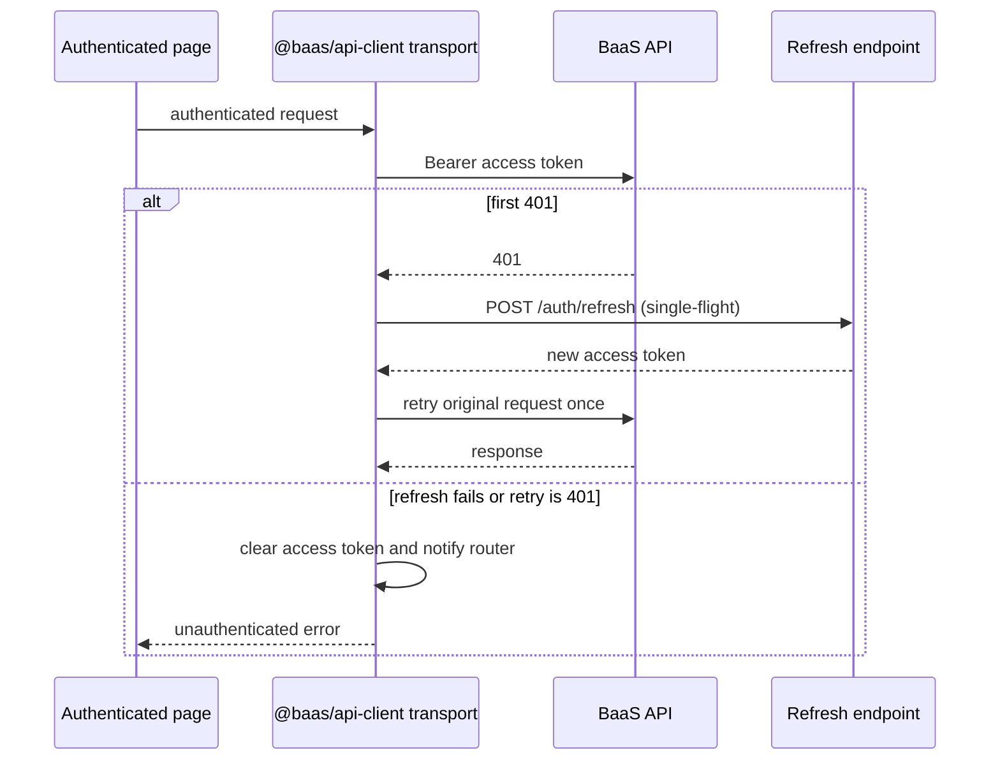

# Console Session and Finance Pages Design

**Spec:** `.specs/features/console-session-and-finance-pages/spec.md`  
**Project decisions:** `.specs/STATE.md` (AD-001, AD-004, AD-006, AD-012, AD-016, AD-020)  
**Status:** Proposed

---

## Architecture Overview

### Approaches considered

| Approach | Trade-off | Verdict |
| --- | --- | --- |
| **Dedicated profile endpoint + shared authenticated transport** | Adds a focused Nest controller/service and refactors API-client request plumbing once | **Recommended and confirmed.** Preserves the existing AuthController changes and removes duplicated 401 behavior. |
| Add profile to `AuthController` + patch every feature client | Edits a locally modified file and duplicates refresh/retry logic across clients | Rejected: conflicts with the preservation constraint and is error-prone. |
| Store profile only in localStorage after registration/login | Avoids endpoint/migration work | Rejected: stale, client-controlled, fails cross-device sessions and violates CONSOLE-01. |

The API exposes `GET /api/v1/session/profile`, deriving the tenant and owner from the verified access token. It returns an allowlisted profile: business names, owner name (or legacy e-mail fallback), owner e-mail, and gateway connection status. The existing registration name is persisted as `users.full_name` through a migration.

`@baas/api-client` gains one shared authenticated JSON transport. On the first 401 it joins/starts a single refresh request, retries the original request once, and clears the browser session after a failed refresh or repeated 401. Every authenticated feature client—including profile, wallet, dashboard, transactions, withdrawals, links, webhooks and reconciliation—uses it.

The React router owns authenticated state and profile loading. It passes profile state and an async logout callback to `AppShell`; it renders new Wallet and read-only Settings pages for their existing hashes.



---

## Code Reuse Analysis

| Existing component / pattern | Location | How it is reused |
| --- | --- | --- |
| Token verification and request principal | `apps/api/src/modules/wallet/runtime-wallet.providers.ts` | Profile endpoint follows the current verified-token principal pattern; no client tenant ID. |
| Merchant and user entities | `apps/api/src/modules/auth/entities/*.entity.ts` | Add `fullName` only to `UserEntity`; read merchant names via existing relationship/query. |
| Swagger and generated contract pipeline | `apps/api/src/platform/configure-application.ts`, `scripts/generate-api-client.mjs` | Decorate the new endpoint and regenerate, never hand-edit generated schema. |
| Session memory store | `packages/api-client/src/index.ts:createBaasMemorySession` | Extend with an optional unauthenticated callback at client construction; clear remains the single token removal operation. |
| Finance layout and test style | `apps/web/src/features/withdrawals/*`, `apps/web/src/features/dashboard/*` | Wallet uses existing Cards/Badge and stale-state vocabulary; tests are co-located with mocked API boundaries. |
| Shell responsive/navigation design | `apps/web/src/app/app-shell.tsx` | Preserve visual structure; replace only identity source and logout interaction. |

### Integration points

| System | Integration method |
| --- | --- |
| MySQL / TypeORM | Add nullable `users.full_name` migration so existing accounts remain readable; new registrations persist a validated name. |
| Auth session | Profile uses Bearer access-token claims; refresh/logout retain existing HttpOnly refresh cookie and CSRF contract. |
| OpenAPI client | Profile endpoint added through Nest Swagger, then `npm run generate:api-client`; wrapper maps generated profile/wallet shapes into web contracts. |
| React hash routing | `#/carteira` and `#/configuracoes` get explicit router branches inside `AppShell`. |

---

## Components

### Owner name persistence

- **Purpose:** Preserve the existing registration `name` as the local owner identity.
- **Location:** `apps/api/src/modules/auth/entities/user.entity.ts`, auth store/service, new migration.
- **Interfaces:** `LocalUser.fullName: string | null`; `AuthStore.createOwner({ fullName })`.
- **Dependencies:** existing TypeORM AuthStore transaction and registration DTO.
- **Compatibility:** Existing null values are represented as e-mail in the profile response; no backfill is invented.

### Current profile API

- **Purpose:** Safely return the authenticated merchant/owner identity used by the console.
- **Location:** new `apps/api/src/modules/session-profile/` module/controller/service.
- **Interface:** `GET /api/v1/session/profile → { merchant: { legalName, displayName }, owner: { fullName, email }, gatewayConnectionStatus }`.
- **Dependencies:** `AuthService`, `DatabaseService`, `UserEntity`, `MerchantEntity`, current token extraction pattern.
- **Security:** User and merchant IDs always come from `verifyAccessToken`; response excludes hashes, IDs, tokens and gateway credentials.

### Authenticated API transport

- **Purpose:** Standardize headers, credential inclusion, one 401 recovery and terminal-session cleanup.
- **Location:** `packages/api-client/src/index.ts` (split into focused internal helpers only if needed).
- **Interface:** internal `authenticatedJson(path, init)` and public profile/logout clients; options gain `onUnauthenticated?: () => void`.
- **Concurrency:** module/client-instance scoped `refreshInFlight: Promise<boolean> | undefined`; all concurrent 401s await it, then retry once.
- **Dependencies:** Existing auth refresh response/token callback and `BaasMemorySession.clear`.

### Wallet page

- **Purpose:** Present the existing wallet snapshot without fabricating confirmed zero balances.
- **Location:** `apps/web/src/features/wallet/wallet-page.tsx`.
- **Interface:** `WalletApi.load(): Promise<{ balanceCents, capturedAt, stale }>`.
- **Behavior:** current/stale/empty/error states; `capturedAt` is shown from the server-provided UTC instant; a `null` or explicit absence is empty, while the current backend compatibility shape (`0` + stale) must be interpreted only as unavailable when the contract can distinguish it.
- **Dependencies:** existing Card/Badge, `createDashboardClient`/new focused wallet client, formatting utilities.

### Read-only settings page

- **Purpose:** Present current business and owner profile with no persistence controls.
- **Location:** `apps/web/src/features/settings/settings-page.tsx`.
- **Interface:** `CurrentProfileApi.load(): Promise<CurrentProfile>`.
- **Dependencies:** profile state supplied by router or same profile client, Card/Badge.

### App router and shell session orchestration

- **Purpose:** Coordinate profile lifecycle, routing, terminal 401 and logout.
- **Location:** `apps/web/src/app/app-router.tsx`, `apps/web/src/app/app-shell.tsx`.
- **Interfaces:** `AppShellProps.profile`, `profileState`, `onLogout`; router `endSession()` clears session and profile and sets `authenticated=false`.
- **Behavior:** login/refresh success reloads profile; terminal 401 calls `endSession`; logout awaits remote call but ends local session in `finally`.

---

## Data Models

```typescript
interface CurrentProfile {
  merchant: {
    legalName: string;
    displayName: string;
  };
  owner: {
    fullName: string | null;
    email: string;
  };
  gatewayConnectionStatus: 'AWAITING_CREDENTIALS' | 'ACTIVE' | 'PROFILE_MISMATCH' | null;
}

interface WalletView {
  balanceCents: string;
  capturedAt: string | null;
  stale: boolean;
}
```

`users.full_name` is nullable for migration compatibility. For new registrations it is required by the existing DTO validation and is stored trimmed. Profile maps `owner.fullName ?? owner.email`; the raw nullable value is not replaced in storage.

---

## Error Handling Strategy

| Scenario | Handling | User impact |
| --- | --- | --- |
| First authenticated 401 | One shared refresh then one retry | No intermediate 401 shown when recovery works. |
| Refresh fails / repeated 401 | Clear session, invoke router unauthenticated callback, reject request | User returns to login without a loop. |
| Non-401 error | Do not refresh; preserve feature error mapping | Feature shows its existing Portuguese failure state. |
| Profile non-401 failure | Keep console navigation; shell uses “Identidade indisponível” | No fictitious identity shown. |
| Logout remote failure | Clear local state in `finally` | User still reaches login. |
| Wallet stale | Show returned values and stale marker | No fabricated zero balance. |
| Wallet no snapshot | Render explicit empty state | No confirmed zero balance claim. |

---

## Risks & Concerns

| Concern | Location | Impact | Mitigation |
| --- | --- | --- | --- |
| Name is collected but discarded as owner identity | `auth-journey.tsx:462-482`, `auth.controller.ts:94-99` | Sidebar/profile cannot identify the account holder correctly. | Persist nullable `users.full_name`, expose it through current profile, test legacy fallback. |
| Wallet service currently represents unavailable as zero plus stale | `apps/api/src/modules/wallet/wallet.service.ts:42-87` | UI cannot always distinguish an actual zero balance from no snapshot. | Add an explicit nullable `capturedAt` to the wallet view contract before the page interprets empty state; preserve values for stale snapshots. |
| Authenticated fetch code is duplicated | `packages/api-client/src/index.ts:131-387` | A partial refactor could leave routes with broken 401 handling. | Route every authenticated client through one transport and add tests for each public client path/sentinel behavior. |
| Relevant local modifications exist | Files listed in `.specs/STATE.md` handoff and current Git status | Overwriting them would mix unfinished work into this feature. | Do not edit listed modified files; create isolated profile module and defer incompatible edits. |
| Sidebar uses localStorage profile | `apps/web/src/app/app-shell.tsx:50-107` | Client-controlled/stale identity and logout residue. | Delete that source path; router-owned API profile is the only identity source. |

---

## Tech Decisions

| Decision | Choice | Rationale |
| --- | --- | --- |
| Owner display identity | Persisted `users.full_name`, fallback to e-mail only for legacy null rows | Matches registration intent while preserving existing data safely. |
| Profile route boundary | Dedicated `session-profile` module | Avoids changes to the locally modified `AuthController` and isolates read-only session representation. |
| 401 coordination | Per-client single-flight refresh and retry-once marker | Correct under concurrent failures without global request loops. |
| Settings scope | Read-only profile | Confirmed scope; avoids unspecified persistence/validation behavior. |

## Requirement Coverage

| Requirement IDs | Design component |
| --- | --- |
| CONSOLE-01..03, CONSOLE-19 | Owner persistence + Current profile API + Shell |
| CONSOLE-04..07 | Wallet page + wallet contract precision |
| CONSOLE-08..10 | Read-only settings page |
| CONSOLE-11..15 | Authenticated API transport + Router session orchestration |
| CONSOLE-16..18 | Logout client + Shell/Router session orchestration |
